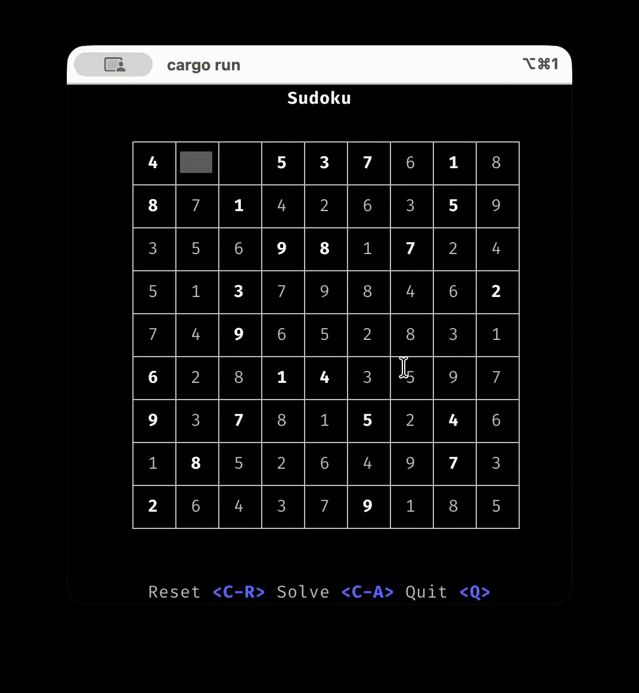

# Sudoku

A Rust-based Sudoku library with an interactive Terminal User Interface (TUI) game.



## Quick Start

### Run the TUI Game

```bash
cargo run --bin tui-game
```

### Run with Custom Difficulty

```bash
# Easy: 40 pre-filled cells
cargo run --bin tui-game -- --filled 40

# Hard: 25 pre-filled cells
cargo run --bin tui-game -- --filled 25
```

## For Agents and Coders
You can find for more details about the code structure and how to develop in [AGENTS.md](AGENTS.md).

## License

See [LICENSE](LICENSE) for details.
